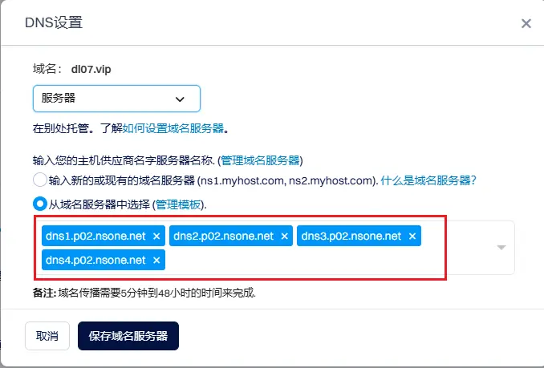

耗时半个月，从零开始搭建本博客。记录一下整个搭建过程。

----
<!--more-->


> 搭建个人博客,常规步骤：**选择博客平台、购买独立域名、服务器或者托管平台**。
## 博客平台
----
博客平台有很多，我最终选择的是使用 [Hugo](https://gohugo.io/) 这个静态网站生成器来搭建我的个人博客。

>Hugo 是一个用 Go 语言编写的静态网站生成器。具有速度快、主题丰富、使用简单等特点。号称是世界上最快的网站生成框架。支持Markdown 语法，可以直接使用Markdown写博客。

Hugo 支持的主题有很多，所有的主题都在 [Hugo Themes](https://themes.gohugo.io/) 里面列出。我目前用的是「[Dream](https://github.com/g1eny0ung/hugo-theme-dream)」主题。
## 购买域名
---
域名需要到专门的域名提供商购买。国外的 「GoDaddy」、「Namecheap」 ，国内的阿里云、腾讯云等等有很多。我是在 [dynadot](https://www.dynadot.com/) 这个网站购买的。价格似乎低一些。
## 发布博客
----
自己是硬件出身，对应服务器、网站运行之类的详细细节并不熟悉。这里直接采用 Netlify 托管的方式来发布博客。

大概的流程：
* 在本地配置好博客源码，上传到 GitHub 上。
* 在 Netlify 上创建一个新的站点，将GitHub的 repo 地址关联到 Netlify，同时绑定好自己的独立域名。
*  Netlify 之后会自动部署和构建博客。构建完成后，就可以正常使用域名访问博客。
详细过程可以参考[在 Netlify 上托管 | Hugo官方文档](https://hugo.opendocs.io/zh-cn/hosting-and-deployment/hosting-on-netlify/) 。

## 详细操作步骤 
----
以下流程均在 Win11 64bit 系统环境下进行。
### 软件环境准备

- 安装 R，[点此下载](https://www.r-project.org/)
- 安装 rstudio，[点此下载](https://www.rstudio.com/products/rstudio/download/#download)
- 安装 git，[点此下载](https://git-scm.com/download/win)
- 注册好GitHub账号，[点此注册](https://github.com/)
- 注册好Netlify账号，[点此注册](https://app.netlify.com/signup)

### Hugo安装
1. 下载 Hugo 程序,当前使用的版本是 **v0.142.0**。[点此下载](https://github.com/gohugoio/hugo/releases) 。 

2. **解压文件**。将文件解压到合适位置，例如：**D:\Program Files\hugo\bin** 。将下载的压缩包解压到该文件夹（解压后该文件夹中应该有 `hugo.exe`、`license` 和 `readme.md` 这三个文件）
3. **设置环境变量**。
	-  打开 Windows 搜索，搜索 “编辑系统环境变量”，点击打开。
	- 点击 “环境变量” 按钮。
	- 在 “用户变量” 中找到以你的用户名开头的那一行，其中有一个名为 “Path” 的变量，点击 “编辑”。
	- 点击 “新建”，然后添加 `D:\Program Files\hugo\bin` 这个路径。
	- 点击 “确定” 关闭所有窗口。
4. **测试安装**。CMD命令行输入**hugo version**。打印如下信息，Hugo程序即安装成功。


### 创建 GitHub 仓库
1. **登录GitHub**：打开浏览器，访问GitHub官网，使用你的GitHub账号登录。

2. **创建新仓库**：在GitHub主页的右上角，点击“+”按钮，然后选择“New repository”。

3. **填写仓库信息**：在创建新仓库的页面，填写以下信息：
	* Repository name：输入仓库的名称，例如“blogs-hugo”。
	* Description（可选）：填写仓库的描述，例如“我的个人网站源码”。
	* Public/Private：选择仓库的可见性，选择 Public 。
	* Initialize this repository with：你可以选择是否初始化仓库，建议勾选“Add a README file”和“Add .gitignore”选项，以便自动生成README文件和.gitignore文件。
4. **创建仓库**：填写完信息后，点击“Create repository”按钮，GitHub会为你创建一个新的仓库。

### 使用 RStudio  创建博客
1. 打开R Studio , File -> New Project ,选择 Version Control -> Git .将创建好的 repo 地址填入，单击Create Project 。


2. 在 RStudio Terminal 中，输入
``` bash 
hugo new site . --force 

git submodule add https://github.com/g1eny0ung/hugo-theme-dream.git ./themes/dream

```


3.  将 **D:\blogs-hugo\themes\dream\hugo.example.toml** 复制到 **D:\blogs-hugo** ，并重命名为 **hugo.toml** 。
4.  Terminal 输入 **hugo server -D** ,  打开浏览器， 输入 http://localhost:1313/ ，显示如下界面，本地博客就搭建成功了。


5. 关于这个主题更多的配置方法，可以参考 [Quick Start | Hugo Theme Dream](https://hugo-theme-dream.g1en.site/) 。


### 上传源码到GitHub


1. 用笔记本打开 **D:\blogs-hugo\.gitignore**  文件， 填入如下内容。
```
# Ignore Hugo resource files
*.hugo*.lock
resources/
public/
config/development/
.Rproj.user
```

2. RStudio 软件右边单击 Git 选项卡，勾选全部的文件后，单击Commit, 输入一些版本信息，例如 added ，单击commit。然后单击Push 。本地博客就同步到GitHub对应的仓库了。


### Netlify 部署设置


1. 本地博客根目录 **D:\blogs-hugo** 创建 netlify.toml 文件。复制如下内容。并使用上面commit、Push步骤同步到GitHub。
``` toml
[build]
command = 'hugo'
publish = 'public'

[build.environment]
HUGO_VERSION = '0.142.0'

[context]
[context.branch-deploy]
command = 'hugo -F -b $DEPLOY_PRIME_URL'

[context.deploy-preview]
command = 'hugo -F -b $DEPLOY_PRIME_URL'

[context.production]
[context.production.environment]
HUGO_ENV = 'production'
 
```
2. 登录进 netlify 后，点击导航栏`Sites`，右侧选择`Add new site` - `Import an existing project` 选择 `Github` 。同步 GitHub 账户后，选择相应博客的 repo 。直接单击页面下方 `Deploy blogs-hugo`
3. 等下Production deploys 下方显示 Published 。表示部署完成。单击上方链接就能看到部署的博客了。  后续再更新GitHub后，netlify都会自动重新部署。  
### 自定义域名

1. 在域名购买网站，找到购买的域名的DNS设置，选择服务器，并填写如下4个地址，保存。    
2. 返回 Netlify ,找到博客site页面左侧  `Domain management`  选项卡，点击进入域名设置。
3. 在 `Add a domain` 一项下点击 `Add a domain you already own`来添加自定义域名。
4. 在弹出来的输入框输出主域名即可，如 `dl07.vip`。
5. 等待 DNS 刷新，看到主域名处出现 _NETLIFY DNS_ 的墨绿色标志即代表成功。此时输入域名，就可访问自己的博客了。

至此，整个博客的搭建环节就完成，下一篇会更新博客写作的流程。

---- 
### 参考链接
[部署 Hugo 网站到 Netlify ](https://www.sulinehk.com/post/deploying-hugo-website-to-netlify/)

[【20分钟讲解如何建立个人网站】](https://www.bilibili.com/video/BV1Be4y1h756/?vd_source=aebdabd3c5a0a89ddca0d41c1492f00b)

----


