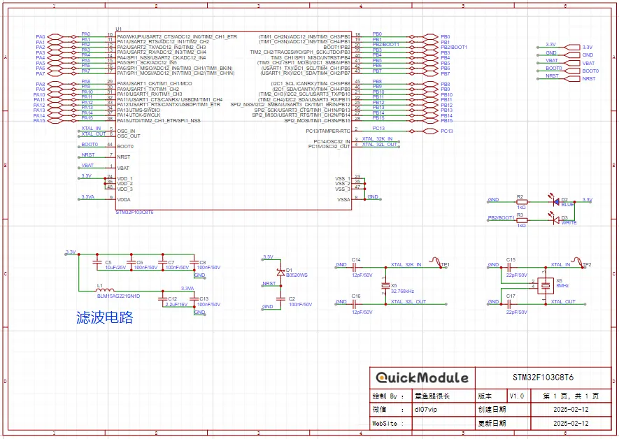
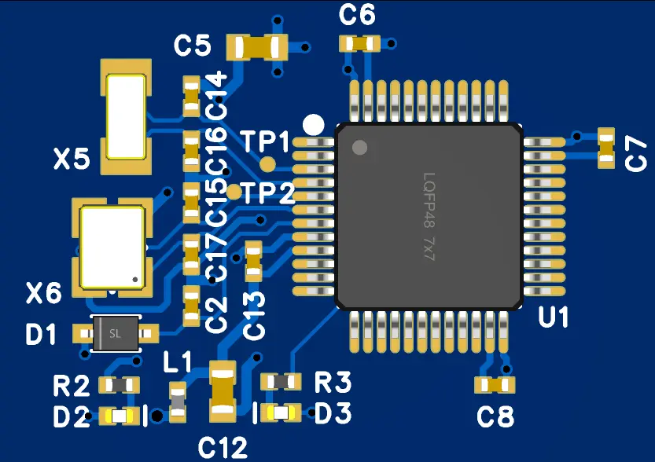
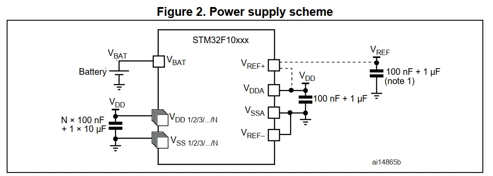
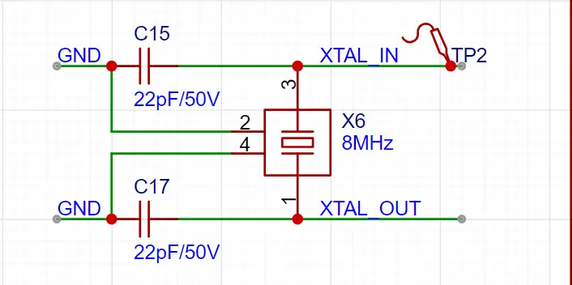
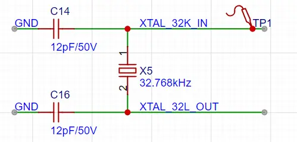
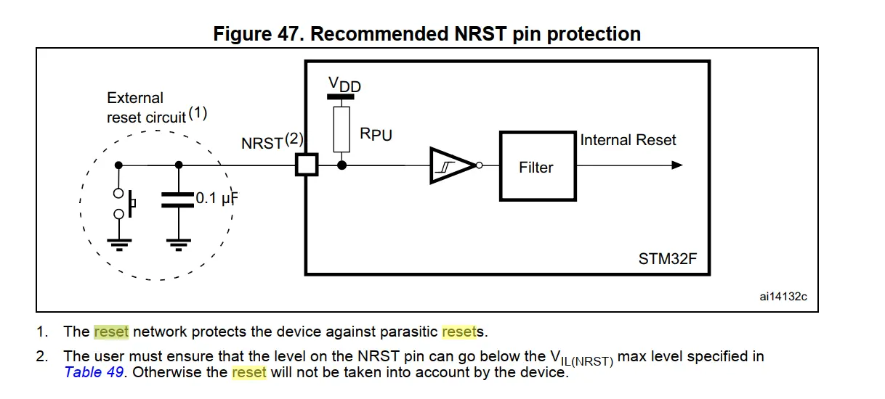
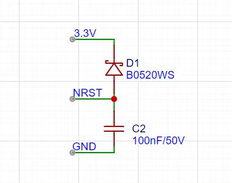

<!--more-->

> 「QuickModule 」 是一系列硬件模块电路的集合。它是为了解决在硬件研发时”重复造轮子”的问题而设计。
> 每个模块设计包含原理图和PCB两部分。模块间通过简单的连接，便可迅速的设计出满足需求的硬件板卡。极大简化了硬件设计过程，缩短设计时间。同时采用标准化的方案，也可以优化BOM种类，降低产品成本。

本文是 `「QuickModule」` 系列的第一篇。STM32F103C8T6 单片机模块电路设计。

## STM32F103C8T6 最小系统设计

STM32F103C8T6 基于 ARM Cortex - M3 内核，有 64KB Flash、20KB SRAM ，外设丰富，含多种通信接口、定时器等。工作电压 2.0 - 3.6V ，功耗低。适用于工控、智能家居等多场景。
其最小系统通常包括了微控制器、时钟电路、电源电路、复位电路以及调试接口电路。下图是模块的原理图以及 3D PCB 图。

### 微控制器（MCU）
STM32F103C8T6拥有非常丰富的外设接口，包括：GPIO、UART、USB、SPI、I2C以及CAN等。出于模块通用性的考虑，本设计直接将所有的IO引出。

### 电源电路
STM32F103C8T6 电源的供电范围 2.0 to 3.6 V 。通常使用3.3V电源。参考如下：

|   PIN    |  定义  |                               设计指导                                |
| :------: | :--: | :---------------------------------------------------------------: |
| 24、36、48 | VDD  |           电源输入，外接3.3V，每个引脚提供一个 100nF 电容，此外额外并联一个10uF电容。           |
|    9     | VDDA |        模拟电源输入，3.3V供电，通过VDD外加磁珠隔离，并增加1个100nF、一个2.2uF 滤波电容。         |
|    1     | VBAT | VBAT引脚可以接外置电池（1.8 V < VBAT < 3.6 V），如果不使用外置电池，接到VDD，并增加1个100nF电容。 |

### 时钟电路

| PIN |         定义         |            设计指导            |
| :-: | :----------------: | :------------------------: |
| 5、6 |   OSC_IN、OSC_OUT   | 系统时钟，使用无源晶体，频率范围 4M-16MHz。 |
| 3、4 | OSC32_IN、OSC32_OUT |      低速时钟，32.768KHz。       |

原理图如下：

### 启动方式

启动方式由 BOOT0 和 BOOT1 两个引脚的电平状态来配置，通过设置不同的引脚电平组合，可以选择从不同的存储区域启动系统，启动方式配置如下图：

| BOOT1 | BOOT0 | 启动模式                      | 说明                                                                                       |
| ----- | ----- | ------------------------- | ---------------------------------------------------------------------------------------- |
| x     | 0     | 主闪存存储器（Main Flash memory） | 从内部的主闪存存储器（Flash）启动，这是最常用的启动模式，用户编写的程序通常存储在该区域，系统上电后会从此处开始执行程序。                          |
| 0     | 1     | 系统存储器（System memory）      | 从系统存储器启动，系统存储器中固化了厂商提供的启动程序（ISP，In-System Programming），用于通过串口等接口对主闪存存储器进行编程，常用于程序的下载和更新。 |
| 1     | 1     | 内置 SRAM（Embedded SRAM）    | 从内置的静态随机存取存储器（SRAM）启动，主要用于调试和开发阶段，可将程序临时加载到 SRAM 中运行，方便快速验证代码。                           |

### 复位电路
芯片手册提供了外部复位的参考电路。低电平需维持至少100ns。

模块设计时，除了放置 100nF 电容，还额外增加了二极管电路，用于断电时快速放电，防止复位异常。

采用上述阻容复位电路，功能比较简单，若想进一步提高复位的可靠性，或者复杂的复位逻辑，可以额外增加单独的复位芯片。

### 调试接口
STM32F103C8T6支持Jtag以及SWD调试接口。通常使用SWD接口。引脚定义如下：

| PIN  |  定义   |
| :--: | :---: |
| PA13 | SWDIO |
| PA14 | SWCLK |

## 模块使用

应用案例解析