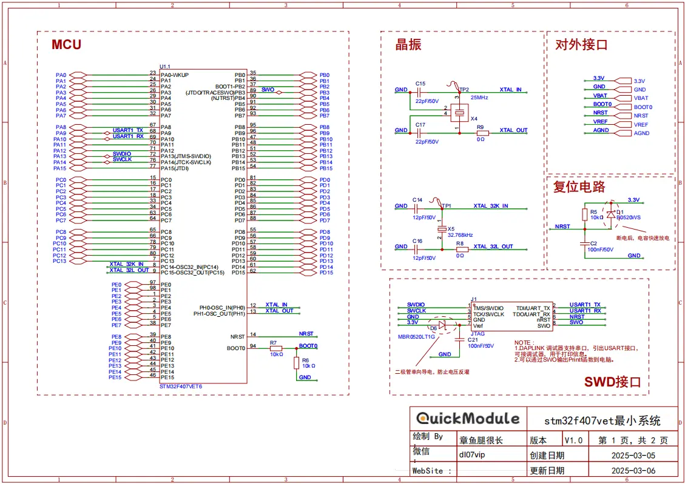
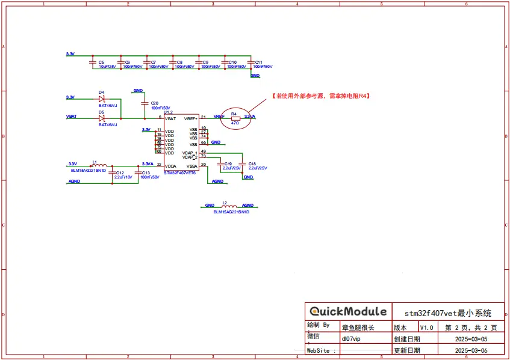
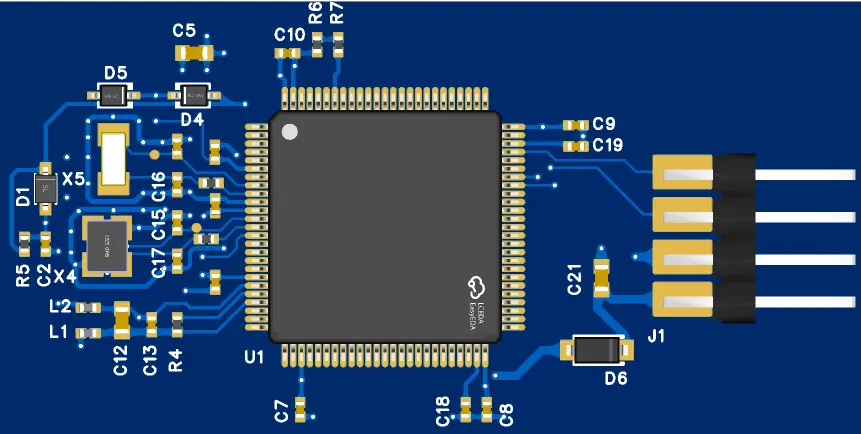
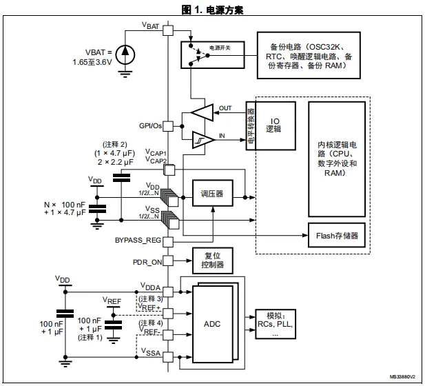
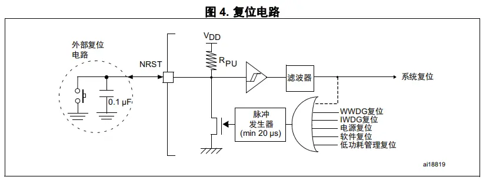
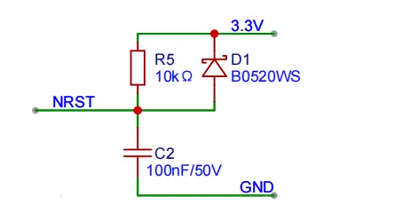
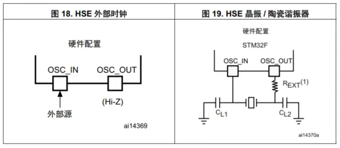
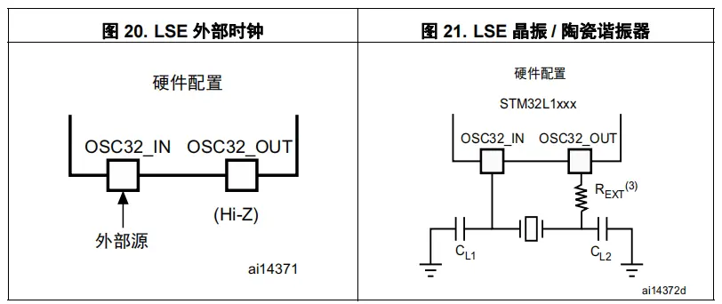
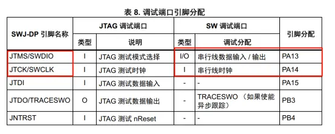

<!--more-->

本文是 `「QuickModule」` 系列的第一篇。更多关于「QuickModule 」内容，可以点击 [链接]()查看。

## STM32F407VET6最小系统设计

STM32F407VET6 采用ARM Cortex-M4 内核，主频 168MHz。512KB 闪存、192KB SRAM ，外设丰富，含多种通信接口、AD/DA等。工作电压 1.8V-3.6V ，功耗低。适用于工控、智能家居等多场景。

STM32最小系统通常包括：电源、复位、时钟、启动配置以及程序下载接口。完整原理图、PCB图如下：

------

### 电源电路
STM32F407VET6整体供电方案如下图：

| 引脚号                | 定义    | 功能介绍                                                           | 设计指导                                                                                |
| ------------------ | ----- | -------------------------------------------------------------- | ----------------------------------------------------------------------------------- |
| 11、19、28、50、75、100 | VDD   | 数字电源，1.8V-3.6V之间，通常使用3.3V。                                     | 1个4.7uF + 每个引脚一个0.1uF电容，尽量靠近引脚方式。                                                   |
| 22                 | VDDA  | 模拟电源，电压需和VDD一致。                                                | 通过磁珠连接到VDD。1*100 nF +1*2.2 µF电容                                                     |
| 21                 | Vref+ | 外部电压参考。VREF+ 必须保持在(VDDA-1.2 V) 和 VDDA 之间                       | VREF+ 引脚可串联47Ω电阻连至 VDDA 外部供电电源。  若使用单独的外部参考电压，则必须将一个 100 nF 和一个 1 µF 电容连至此引脚。 |
| 6                  | Vbat  | 电池供电引脚，1.65V-3.6V。主电源 VDD 断电时，可通过 VBAT 电压为实时时钟 (RTC) 和备份寄存器供电。 | 若没有使用外部电池，VBAT 连至 VDD。并增加1*0.1uF电容。使用外部电池，不需要电容。                                    |
| 49、73              | Vcap  | 常规使用，外接电容即可                                                    | 每个引脚放置1个2.2uF。                                                                      |
| 20                 | VSSA  | 模拟地                                                            | 通过磁珠连接到GND。                                                                         |
| 10、27、74、99        | VSS   | 数字地。                                                           |                                                                                     |

### 复位电路

| 引脚号 | 定义   | 功能介绍        |
| --- | ---- | ----------- |
| 14  | NRST | 复位引脚，低电平有效。 |

单片机内部已集成上电复位电路。为了增加单片机抗干扰能力，最好额外增加外部复位电路。

电路采用常用的RC复位电路，同时在复位引脚和电源之间增加一个肖特基二极管，用于掉电时电容快速放电。此外，若想使复位更加可靠，可以使用专门的复位IC，例如[**MAX811S**](https://item.szlcsc.com/6243208.html?fromZone=l_c__%2522catalog%2522&spm=sc.cid.xh9.zy.n___sc.gb.xh2.zy.l&lcsc_vid=RVZYVgVUQVRYAQAEQFlbX1VVQFlXUVEHTwNZBVIEFVcxVlNSRlBYVFdXQlJaVDsOAxUeFF5JWBYZEEoVDQ0NFAdIFA4DSA%3D%3D "MAX811S")。

>Tip: 如何计算RC复位电路时间？
### 时钟电路

芯片需要一个高速外部晶振（HSE）和一个低速外部晶振（LSE）。

**高速外部时钟**
高速外部时钟信号 (HSE) 支持 2种时钟源：

* HSE 用户外部时钟 （参见图 _18_），频率范围1 到 50 MHz。必须使用占空比约为 50% 的外部时钟信号 （方波、正弦波或三角波）来驱动 OSC_IN 引脚，同时 OSC_OUT 引脚悬空。

* HSE 外部晶振 / 陶瓷谐振 （参见图 _19_）,频率范围 4 至 26 MHz。

**低速外部时钟**

LSE 晶振是 32.768 kHz 低速外部晶振或陶瓷谐振器。可作为实时时钟外设 (RTC) 的时钟源来提供时钟 / 日历或其它定时功能，具有功耗低且精度高的优点。低速外部时钟信号 (LSE) 有 2 个时钟源：

* LSE 用户外部时钟（请参见图 20），使用占空比约为 50% 的外部时钟信号 （方波、正弦波或三角波）来驱动OSC32_IN 引脚，同时 OSC32_OUT 引脚悬空 。
* LSE 外部晶振 / 陶瓷谐振 （参见图 21）。

| 引脚号   | 定义           | 功能介绍   |
| ----- | ------------ | ------ |
| 12、13 | OSC_IN、OUT   | 高速晶振接口 |
| 8、9   | OSC32_IN、OUT | 低速晶振接口 |

### 启动模式配置

启动方式由 BOOT0 和 BOOT1 两个引脚的电平状态来配置，通过设置不同的引脚电平组合，可以选择从不同的存储区域启动系统，启动方式配置如下图：

| BOOT1 | BOOT0 | 启动模式                      | 说明                                                                                       |
| ----- | ----- | ------------------------- | ---------------------------------------------------------------------------------------- |
| x     | 0     | 主闪存存储器（Main Flash memory） | 从内部的主闪存存储器（Flash）启动，这是最常用的启动模式，用户编写的程序通常存储在该区域，系统上电后会从此处开始执行程序。                          |
| 0     | 1     | 系统存储器（System memory）      | 从系统存储器启动，系统存储器中固化了厂商提供的启动程序（ISP，In-System Programming），用于通过串口等接口对主闪存存储器进行编程，常用于程序的下载和更新。 |
| 1     | 1     | 内置 SRAM（Embedded SRAM）    | 从内置的静态随机存取存储器（SRAM）启动，主要用于调试和开发阶段，可将程序临时加载到 SRAM 中运行，方便快速验证代码。                           |

### 程序下载调试接口
芯片支持JTAG以及SWD调试接口。SWD接口较为常用。

以下是源文件，仅供参考：
[腾讯微云](https://share.weiyun.com/4756YWFE)
